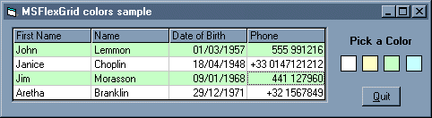

<div align="center">

## MSFlexGrid row colors


</div>

### Description

This short SUB will allow you to set alternate colors in rows background of any MSflexGrid in your project. It will work with any number of rows and columns. (upgraded version of Raul Lopez submission).
 
### More Info
 
MSFlexgrid name, RGB values


<span>             |<span>
---                |---
**Submitted On**   |
**By**             |[HarvestR](https://github.com/Planet-Source-Code/PSCIndex/blob/master/ByAuthor/harvestr.md)
**Level**          |Intermediate
**User Rating**    |4.8 (38 globes from 8 users)
**Compatibility**  |VB 3\.0, VB 4\.0 \(16\-bit\), VB 4\.0 \(32\-bit\), VB 5\.0, VB 6\.0, VB Script, ASP \(Active Server Pages\) 
**Category**       |[Coding Standards](https://github.com/Planet-Source-Code/PSCIndex/blob/master/ByCategory/coding-standards__1-43.md)
**World**          |[Visual Basic](https://github.com/Planet-Source-Code/PSCIndex/blob/master/ByWorld/visual-basic.md)
**Archive File**   |[](https://github.com/Planet-Source-Code/harvestr-msflexgrid-row-colors__1-9896/archive/master.zip)


### Source Code

```
'Put this code in a .bas module
Public Sub MSFlexGridColors(ColorGrid As MSFlexGrid, R As Integer, G As Integer, B As Integer)
For j = 0 To ColorGrid.Cols - 1
  For i = 1 To ColorGrid.Rows - 1
    If i / 2 <> Int(i / 2) Then
      ColorGrid.Col = j
      ColorGrid.Row = i
      ColorGrid.CellBackColor = RGB(R, G, B)
    End If
  Next i
Next j
End Sub
'Then use this code to activat the SUB:
'(general: MSFlexGridColors MSFlexGrid, Red, Green, Blue)
MSFlexGridColors Form1.MSFlexGrid, 192, 255, 192
'I hope this can help you for your design
```

